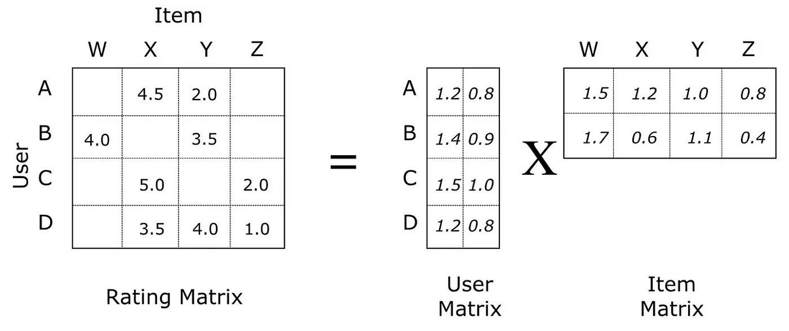

# Spark MLLib 

[참고 자료](https://spark.apache.org/mllib/) · [Zepplin 코드](https://github.com/Eunsoojoe/dmf-spark/tree/main/4.MLlib)

- zeppelin 실행 
    - `cd zeppelin-0.10.1/`
    - `bin/zeppelin-daemon.sh start`
- hardoop 실행
    - `~/hadoop-3.3.6/sbin/startgit-all.sh`
    - hardoop 내 airlinedata 확인 
- hardoop에 있는 파일 불러오기
- 형변환 / String데이터의 벡터화
    - `df = df.withColumn('ArrDelay', df['ArrDelay'].cast('integer'))`
    - StringIndexer 
- VectorAssembler 통해 Feature 화

#### 전처리 process

        ```spark
        df = spark.read.csv('/user/ubuntu/input/airline/1988.csv', header=True, inferSchema=True)

        # 특정 컬럼선택
        df = df.select('DayOfWeek', 'FlightNum', 'UniqueCarrier', 'Origin', 'Dest', 'Cancelled')

        # 문자열 데이터를 숫자화
        from pyspark.ml.feature import StringIndexer
        indexer = StringIndexer(inputCols=['UniqueCarrier','Origin', 'Dest'], outputCols=['CarrierIndex','OriginIndex', 'DestIndex'])
        df = indexer.fit(df).transform(df)
        
        # 벡터화
        feature_names = ['DayOfWeek','FlightNum','CarrierIndex','OriginIndex','DestIndex']

        assembler = VectorAssembler(inputCols=feature_names, outputCol='feature')
        df = assembler.transform(df)
        
        ```
- tarin/test 데이터셋 분리
- 모델 학습 및 오차 분석
    - 선형 회귀 
    - 분류 
    - 추천 | *als model 적용 
        


