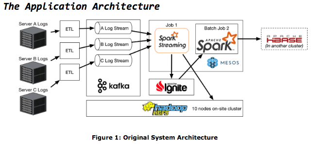

# Spark Streaming 실시간 데이터 처리
[Document. Spark Streaming](https://spark.apache.org/docs/latest/streaming-programming-guide.html)

## Overview

- [Up-bit](https://docs.upbit.com/reference/ticker%ED%98%84%EC%9E%AC%EA%B0%80-%EC%A0%95%EB%B3%B4)에서 비트코인 데이터를 실시간으로 카프카에 전송
- Kafka가 순서대로 정리,이를 Spark가 구독
- CSV 형태로 변환해서 HDFS에 저장

## Process
- zepplin 실행, 노트북 생성 `$ZEPPELIN_HOME/bin/zeppelin-daemon.sh start` `localhost:9090`
- spark에서 socket(양방향 통신,↔http)으로 서버와 연결 
    ```python
    lines = spark.readStream.format('socket')\
        .option('host','localhost')\
        .option('port','2222')\
        .load()
    ```
- hardoop 실행 `sbin/start-dfs.sh` `lochalhost:9870`
- 만든 포트 열어주기 `nc -lk 2222`
    ```python
    query = lines_with_time.writeStream\

        # 1분에 한번씩 묶어서 처리
        .trigger(processingTime='1 minute')\     
        
        # output이 나올때마다 추가
        .outputMode('append')\                   
        .format('csv')\

        # 저장 경로
        .option('path', 'hdfs://localhost:9000/user/ubuntu/output/streaming-test')\   
        
        # 중간단계 점검 
        .option('checkPointLocation', 'hdfs://localhost:9000/user/ubuntu/output/streaming-test-check')\ 
        .start()    

    # 반복
    query.awaitTermination()    

    # 백슬래쉬 인덴트 잘 맞춰주기
    ```

-  up-bit api 통해 데이터 반복 수집
- <b>[카프카 설치](https://kafka.apache.org/quickstart)</b>

    - 카프카란? <br>
     메시지 브로커 프로젝트, 어떤 문자를 '브로커'가 계속해서 수집하고 축적. 필요한 사람에게 공급, pub-sub 구조, Spark가 subscriber
    ---

    - 설치 및 unzip `wget https://dlcdn.apache.org/kafka/3.8.0/kafka_2.13-3.8.0.tgz`
 `tar -zxvf kafka_2.13-3.8.0.tgz`

    - zookeeper 서버 실행 
        ```
        # zookeeper 실행
        bin/zookeeper-server-start.sh -daemon config/zookeeper.properties
        
        # kafka 실행
        bin/kafka-server-start.sh -daemon config/server.properties​       
- topic 생성 (수집하는 데이터의 전체 제목을 설정) 
<br>`bin/kafka-topics.sh --create --topic quickstart --bootstrap-server localhost:9092`
- upbit-api.py 생성 후 데이터 수집 `poll - produce - flush`
- 수집된 데이터 csv 저장 후 hardoop에 저장
<br><br>
### 참고자료
- [카프카 주요 개념](https://wildeveloperetrain.tistory.com/225)
- [카프카 설치](https://echo-edu.notion.site/kafka-install-99879f508abf4ff8b2868eb9099a1a57)
- [Streaming Data 처리](https://echo-edu.notion.site/spark-streaming-8579af9c09834ad385e061ae0e7c3fcc)
    